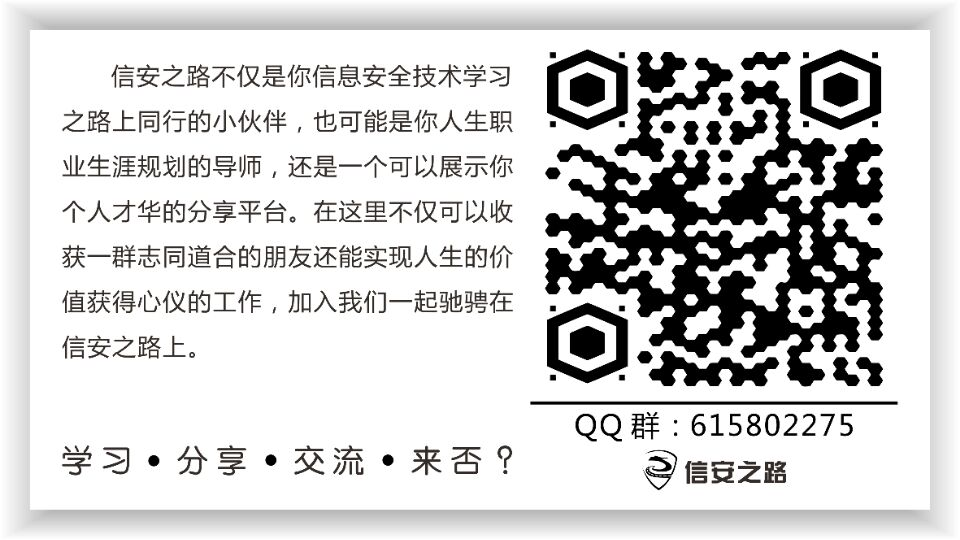

# 信安之路成长计划
Growth plan of The road to information security

## 信安之路
信安之路 是一群来自民间的安全从业人员，旨在提高从业人员安全技能。专注分享信息安全技术学习与实践的点点滴滴，打造自由学习、交流、分享的安全平台，争做安全从业人员的好帮手！

#### 使命：争做安全从业人员的好帮手
我们信安之路存在的意义就是要帮助所有安全从业人员，任何一个安全从业人员都会经历多个阶段：知道安全这个行业、决定加入安全行业、入门安全行业、为社会做贡献成为企业的一份子、负责一个企业、创造一个企业等。

信息安全行业是一个需要不断学习的行业，新的安全威胁随着科技的发展而诞生，而信安之路正好贴合这个意义，开发无尽头，我们要在安全从业人员所处的各个阶段都能有所帮助，所以分享的内容不会限制，只要是对安全从业人员有帮助，有自己的创新，那么就属于我们分享范围。

#### 愿景：打造自由学习、交流、分享的安全平台
从信安之路诞生起我就想要打造一个分享的平台，而不是一个人 YY 的领地，一个人的信安之路是一条溪流，而一群人的信安之路将是一条大河，可以承载更多的人在信安之路上驰骋。

一个平台只是分享那是不会长久的，毕竟内容的产出需要大量的时间学习和实践，在学习和实践的过程的中，如果遇到难题，在没有经验的情况下就相当于创造，如果得到有经验的前辈指点一二，那么难题就成了一个目标，很快就会转变为自己的实践经验，然后在后人再次遇到的时候，我们就可以将这个经验进行传承，一带一路不就是这样吗，信安行业也需要有经验的前辈带领我们在信安之路奔跑。

对于安全行业的小伙伴来说，聪明、极客精神、不走寻常路是我们的代名词，而自由是我们每一个安全从业者所向往的，信安之路就是要做可以自由学习、经验交流和技术分享的平台，做好技术沉淀、传承安全经验、让每一个走在信安之路上的小伙伴都不觉得孤单，在自己想要放弃的时候，看一看身边还在坚持的小伙伴，会让你在信安之路上再走一段，久而久之，你将在信安之路上越走越远。

信安之路为了实现这个愿景，创建了多个兴趣小组，每一个兴趣小组都有一个从事相关职业的组长，由组长来决定加入的成员，保证圈子的质量，经过交流，碰撞技术的火花从而产出对行业有帮助的内容，久而久之，信安之路将变成安全行业的航空母舰，而驱使这艘航母的动力就来自于所有参与者的分享情怀，只有发自内心的动力才是永动力。

#### 价值观：专注分享信息安全技术的学习和实践
现实中的诱惑非常多，互联网圈子，流量为王，在你达到一定流量之后，诱惑也随之而来，比如：公众号自带的流量主（底部广告栏和文中广告）、培训机构的推广、还有很多赚钱的项目。能否守住底线，不被一些现实的东西所左右是非常重要的。

在信安之路诞生到现在的两年时间，我们一直保持不蹭热点、不扯淡，专注分享信息安全技术的原理和细节、安全学习的经验、工作中实践的点滴记录、安全从业人员的价值体现等内容，坚持创新，任何一篇文章都是付出很多努力和时间的结果。

从一个公众号的角度来看，转载一篇文章比创新一篇文章所花费的时间和精力不可同日而语，我们为什么非要坚持原创而不转载，这就是我们坚守自己价值观的体现。

#### 公众号

